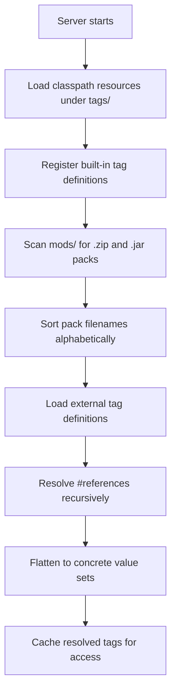
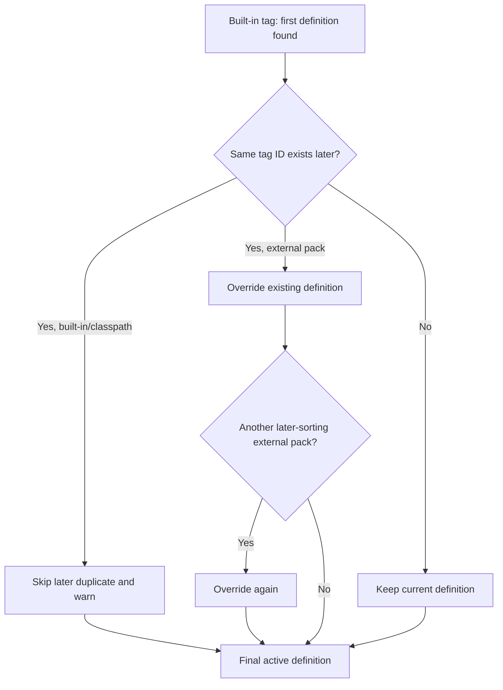
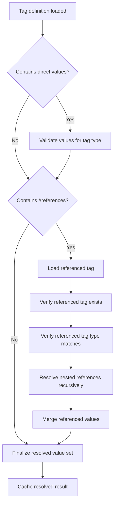
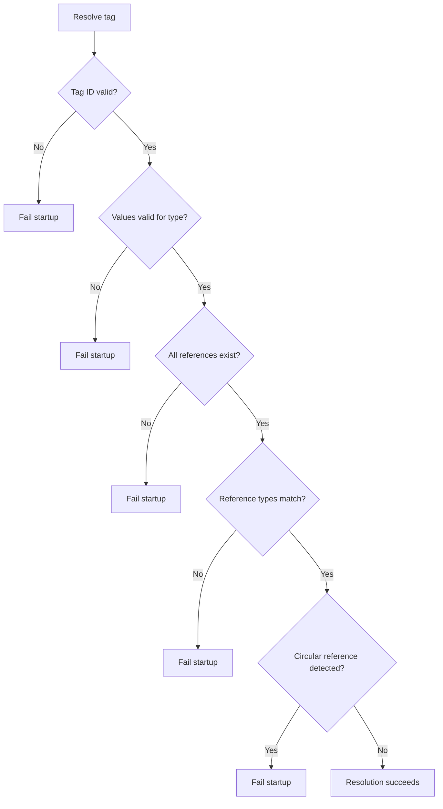
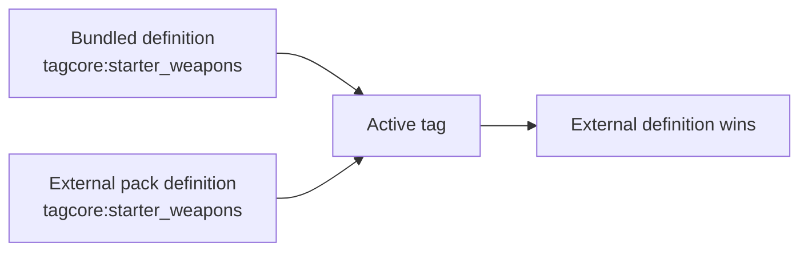

# Tag Loading

This page explains how TagCore discovers, registers, resolves, and overrides tag definitions at startup.

## Overview

At a high level, TagCore loads built-in and classpath tags first, then loads external packs from the server `mods/` directory, and finally resolves tag references into flattened value sets.



## Load Order

TagCore loads tags in this order:

1. Classpath resources under `tags/`
2. External `.zip` and `.jar` packs from the server `mods/` directory

External packs are processed in **alphabetical filename order**.


## Override Rules

### Built-in and classpath tags

If multiple built-in or classpath tag definitions use the same tag ID, the first one loaded is kept and later duplicates are skipped with a warning.

### External packs

External packs load after built-ins and may override existing tags with the same ID.

Because external packs are processed in ascending filename order, later-sorting pack files have final priority when multiple packs define the same tag.

## Effective Precedence

TagCore resolves precedence using this model:

1. Earliest built-in/classpath definition wins among built-ins.
2. External packs override built-ins.
3. Among external packs, the last pack in ascending filename order wins.



## Resolution Behavior

After tags are collected, TagCore resolves `#references` recursively and flattens them into concrete value sets.

This happens eagerly so that configuration problems appear during startup instead of later during gameplay.



## Validation

TagCore detects these classes of problems while resolving tags:

- Invalid content values
- Missing tag references
- Wrong-type references
- Circular references
- Invalid tag IDs



## Example Override

### Bundled tag

```json
{
  "id": "tagcore:starter_weapons",
  "type": "item",
  "values": [
    "Sword_Wooden"
  ]
}
```

### External override

```json
{
  "id": "tagcore:starter_weapons",
  "type": "item",
  "values": [
    "Sword_Wooden",
    "Bow_Basic",
    "Dagger_Rusty"
  ]
}
```

In this case, the external version replaces the bundled version because it loads later.



## Notes

- Values must be valid IDs for the declared tag type.
- References must point to tags of the same type.
- Resolved values are cached after first access.
- TagCore is designed to fail fast on broken tag definitions.
